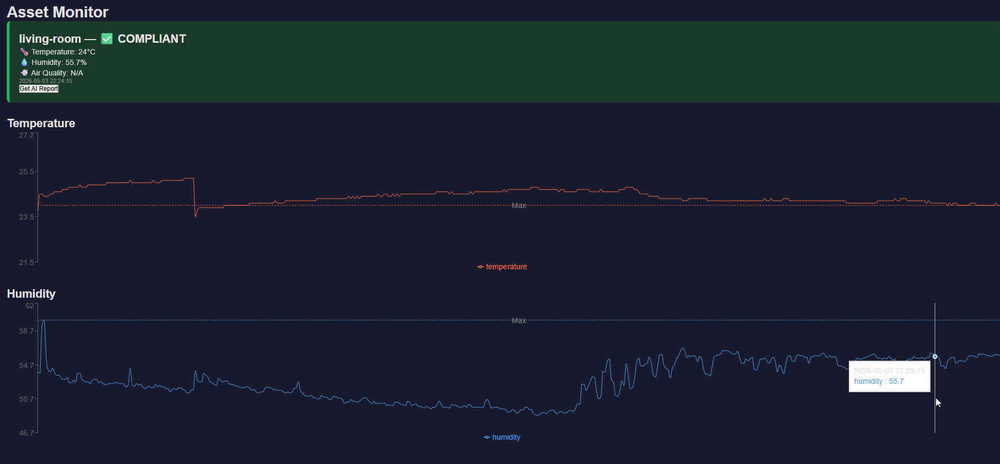

# Asset Monitor — IoT + AI Compliance System

A full-stack IoT application that collects real-time environmental sensor data via a Raspberry Pi, stores it in a persistent database, and uses an AI layer to check readings against a defined asset specification — flagging non-conformances in natural language.

Built as a portfolio project at the intersection of software engineering and digital construction domain expertise.

---

## Architecture

```
Raspberry Pi ( sensors )
        ↓
Node.js REST API (Express + SQLite)
        ↓
AI Compliance Layer (Anthropic API)
        ↓
React Dashboard (live readings + alerts)
```

---

## Tech Stack

| Layer | Technology |
|---|---|
| Hardware | Raspberry Pi 4, DHT22, MQ-135 |
| Backend | Node.js, Express |
| Database | SQLite (better-sqlite3) |
| AI Layer | Anthropic Claude API |
| Frontend | React |
| Deployment | TBD (Railway / Vercel) |

---

## Current Status

- [x] Node.js REST API with Express
- [x] SQLite database with persistent storage
- [x] POST `/readings` — ingest sensor data
- [x] GET `/readings` — retrieve all readings
- [x] GET `/compliance/:sensor_id` — room-specific AI compliance
- [x] Raspberry Pi sensor integration
- [x] AI compliance checking layer
- [x] AI Button
- [ ] React dashboard
- [ ] Deployment

---

## API Reference

### POST `/readings`
Ingest a new sensor reading.

**Request body:**
```json
{
  "sensor_id": "living-room",
  "temperature": 21.5,
  "humidity": 63.2,
  "air_quality": 142
}
```

**Response:**
```json
{
  "id": 1
}
```

### GET `/readings`
Returns all readings ordered by timestamp descending.

**Response:**
```json
[
  {
    "id": 1,
    "sensor_id": "living-room",
    "temperature": 21.5,
    "humidity": 63.2,
    "air_quality": 142,
    "timestamp": "2026-04-30 13:58:55"
  }
]
```

---

## Local Setup

```bash
# Clone the repo
git clone https://github.com/GianClaudioScarafini/asset-monitor
cd asset-monitor

# Install dependencies
npm install

# Start the server
npm start
```

Server runs on `http://localhost:3000`

---
## Dashboard




---

## Background

This project combines two areas of expertise:

**Digital Construction** — the AI compliance layer is conceptually modelled on Asset Information Requirements (AIR) from ISO 19650. Sensors report against a defined specification, and non-conformances are flagged automatically — the same assurance logic applied to physical assets that BIM/IM practitioners apply to information deliverables.

**Software Engineering** — built to demonstrate full-stack capability: hardware integration, REST API design, database persistence, AI API integration, and a React frontend.

---

## Author

Gian Claudio Scarafini
[github.com/GianClaudioScarafini](https://github.com/GianClaudioScarafini) · [LinkedIn](https://www.linkedin.com/in/gian-claudio-scarafini)
